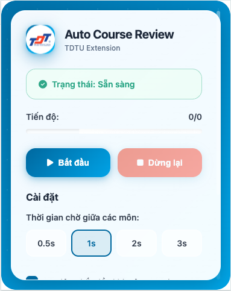

# 🎓 TDTU Auto Course Review Extension

A modern Chrome extension designed to automatically fill out course evaluation forms and complete online Skills courses for Ton Duc Thang University (TDTU) students with a beautiful, contemporary React + TypeScript interface featuring official TDTU branding.


## 📸 Demo

<div align="center">
  
</div>

## 🎬 Video Introduction

> **📹 Detailed Usage Guide**  
> Watch the demo video to understand how to install and use the extension in the most intuitive way.

<div align="center">

### 🎥 Video Demo

**[▶️ Watch Tutorial Video](https://github.com/iannwendy/TDTUAutoCourseReview/raw/main/introduction/introduction.mp4)**

*Click the link above to watch the detailed tutorial video*

---

**📱 Can't watch the video?**
- [📥 Download video to your device](https://github.com/iannwendy/TDTUAutoCourseReview/raw/main/introduction/introduction.mp4) (Right-click → Save as)
- Or access the `introduction/` folder in the repository

</div>

## ✨ Features

- 🚀 **Automatic Course Scanning**: Automatically detects unevaluated courses
- ⚡ **Multiple Speed Options**: Choose from 0.5s, 1s or 2s delays
- 🎯 **Smart Form Filling**: Automatically fills evaluation forms with highest ratings
- 🔄 **Multi-page Handling**: Seamlessly handles Survey.aspx and Result.aspx pages
- 📚 **Auto Next E-learning**: Automatically clicks "Next" buttons on TDTU e-learning platform
- 🎓 **Smart Learning Automation**: Only activates on Unit/Index learning pages, not homepage
- 📊 **Progress Tracking**: Visual progress bar with real-time status updates
- 💾 **Persistent Settings**: Your preferences are saved and restored automatically
- 🎨 **Modern React UI**: Built with React 18 + TypeScript for superior performance
- 🌈 **Glass Morphism Design**: Beautiful modern interface with backdrop blur effects
- 🎭 **Dynamic Themes**: Multiple theme options with smooth animations

## 🛠️ Installation

### Method 1: Load Unpacked Extension (Recommended)

1. **Download the extension**:
   ```bash
   git clone https://github.com/iannwendy/TDTUAutoCourseReview.git
   cd TDTUAutoCourseReview
   ```

2. **Open Chrome Extensions**:
   - Go to `chrome://extensions/`
   - Enable "Developer mode" (top right toggle)

3. **Load the extension**:
   - Click "Load unpacked"
   - Select the downloaded folder
   - Extension will appear in your toolbar

### Method 2: Manual Download

1. Download the ZIP file from this repository
2. Extract to a folder
3. Follow steps 2-3 from Method 1

## 🚀 Usage

### 📝 Auto Course Review

1. **Navigate to TDTU Course Evaluation**:
   - Go to `teaching-quality-survey.tdtu.edu.vn/choosesurvey.aspx`
   - Login with your student credentials

2. **Configure Extension**:
   - Click the extension icon in Chrome toolbar
   - Choose your preferred processing speed:
     - **Instant (0s)**: Fastest processing
     - **Fast (0.5s)**: Quick with minimal delay
     - **Normal (1s)**: Balanced speed (default)
     - **Slow (2s)**: Safest option

3. **Start Auto Review**:
   - Click "Bắt đầu tự động đánh giá" (Start Auto Review)
   - Watch the progress bar as it processes each course
   - Extension will automatically handle all pages

4. **Monitor Progress**:
   - Real-time status updates
   - Visual progress tracking
   - Automatic completion notification

### 📚 Auto Next E-learning

1. **Navigate to TDTU E-learning**:
   - Go to `elearning-ability.tdtu.edu.vn/Unit/Index/`
   - Login with your student credentials

2. **Activate Auto Next**:
   - Click the extension icon in Chrome toolbar
   - In the "Auto Next (elearning)" section, click "Bật Auto Next"
   - Extension will automatically start clicking "Next" buttons every 200ms

3. **Monitor Auto Next Status**:
   - Real-time click counter
   - Button detection status
   - Automatic stop when leaving Unit/Index pages

4. **Smart Features**:
   - Only works on actual learning content pages (`/Unit/Index/`)
   - Automatically stops if you navigate away from learning pages
   - Visual highlighting of buttons before clicking
   - Safe button validation (visibility and enabled state)

## 📋 How It Works

The extension follows this workflow:

```
choosesurvey.aspx → Survey.aspx → Result.aspx → Back to choosesurvey.aspx
       ↓               ↓            ↓                    ↓
   Scan courses    Fill forms   Click continue      Next course
```

1. **Course Detection**: Scans the course table for "Chưa đánh giá" (Not evaluated) status
2. **Form Navigation**: Clicks "Chọn" (Choose) buttons to enter evaluation forms
3. **Auto-Fill**: Fills all rating fields with highest values (5 stars)
4. **Page Transitions**: Automatically handles "Tiếp tục" (Continue) buttons
5. **Loop Process**: Returns to course list and processes next course

## 🔧 Technical Details

### Architecture
- **Frontend**: React 18 + TypeScript
- **Build System**: Webpack 5 with custom configuration
- **Styling**: Modern CSS with Glass Morphism effects
- **State Management**: React Hooks (useState, useEffect)
- **Chrome APIs**: Manifest V3 with service workers

### Build Process
```bash
# Development
cd react-popup
npm install
npm run dev

# Production Build
npm run build

# Deploy to Extension
./switch-to-react.sh
```

## 🛡️ Privacy & Security

- ✅ **No Data Collection**: Extension doesn't collect or store personal data
- ✅ **Local Processing**: All operations happen locally in your browser
- ✅ **Minimal Permissions**: Only requests necessary permissions
- ✅ **Open Source**: Full source code available for review
- ✅ **Type Safety**: TypeScript ensures code reliability


## 📝 Changelog

For detailed changelog, see [CHANGELOG.md](CHANGELOG.md)

## 📄 License

This project is licensed under the MIT License - see the [LICENSE](LICENSE) file for details.

## 👨‍💻 Author

**@iannwendy**
- 🔗 GitHub: [@iannwendy](https://github.com/iannwendy)
- 📘 Facebook: [@iannwendy2](https://facebook.com/iannwendy2)
- 📸 Instagram: [@iannwendy](https://instagram.com/iannwendy)

## ⚠️ Disclaimer

This extension is created for educational purposes and to help TDTU students efficiently complete their course evaluations. Please use responsibly and in accordance with your university's policies.

---

<div align="center">
  <p>Made with ❤️ for TDTU students.</p>
  <p>⭐ Star this repo if it helped you!</p>
  <p>© 2025 Bao Minh-Nguyen Co., Ltd. All Rights Reserved.</p>
</div> 
